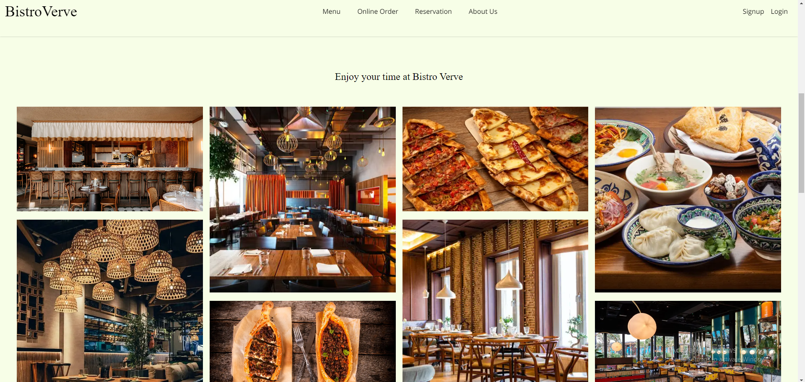
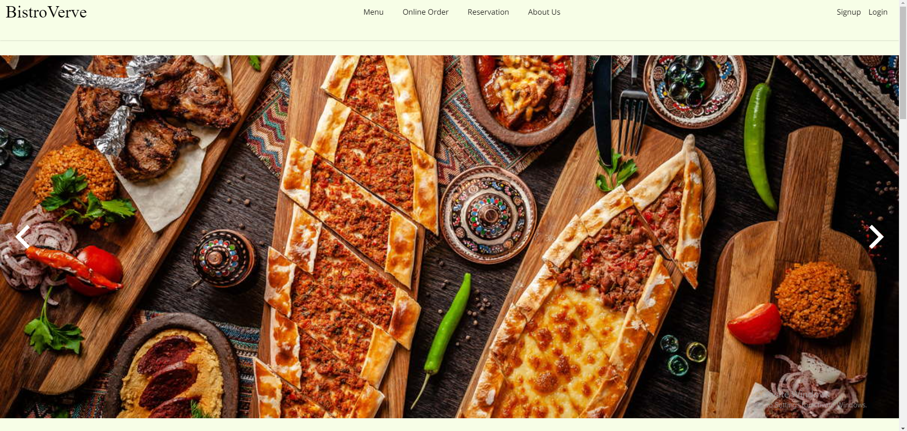
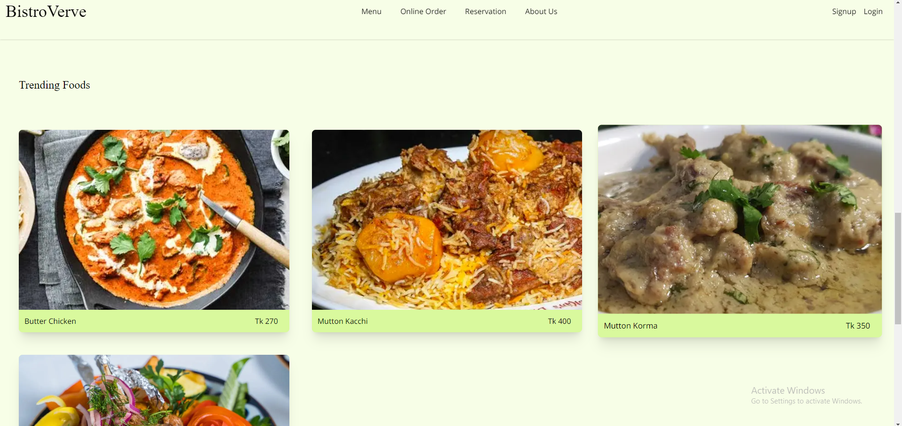
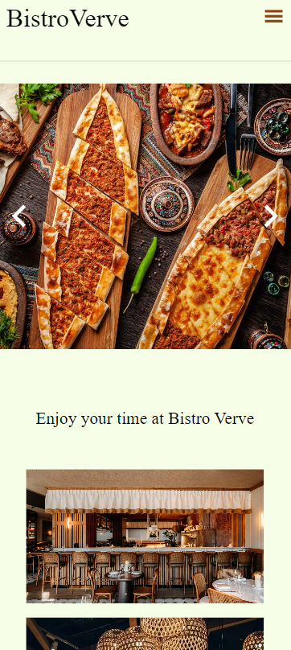
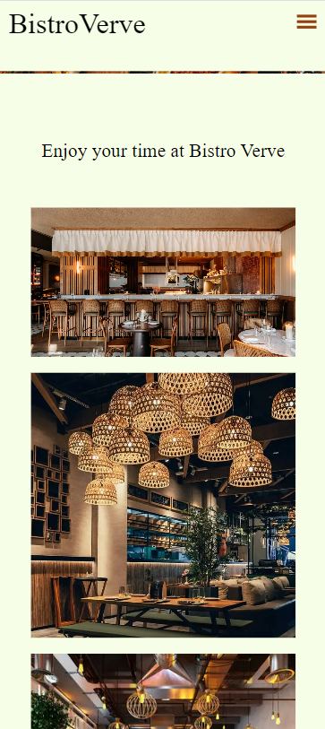
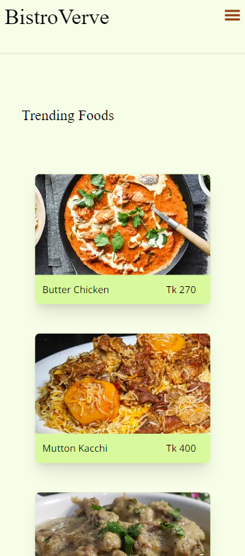

# Restaurant Home Page Using Next.js And Tailwind CSS.

## This project is a simple, responsive restaurant home page designed for various screen sizes, created using Next.js and Tailwind CSS.

### To run this project locally-

- Clone the repository.
- Navigate into the project directory.
- Install dependencies. (npm install)
- Start the development server (npm run dev)
- Open (http://localhost:3000) with your browser to view the application.

### Here are some pictures of the restaurant homepage-

  
   
  

